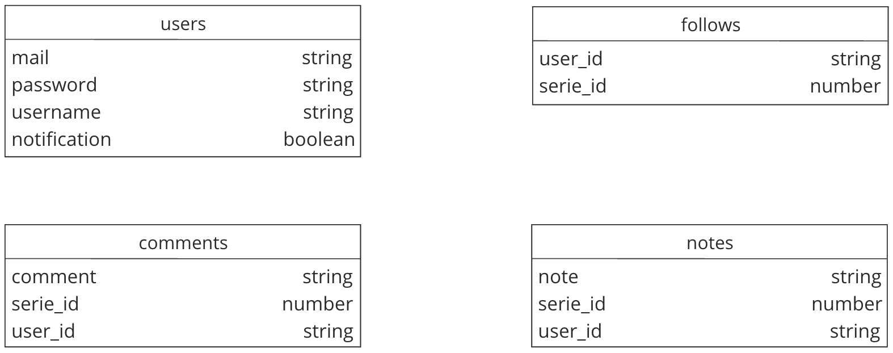

# L2_PARIS_REACT

## Database 

 
#### Schema de la base de données

## Description 

Ce projet consiste à pouvoir visualiser des séries, pouvoir les noter, les suivres ainsi que de mettre un avis dessus. 

L'utilisateur peur accéder à la liste des séries qu'il suit et reçoit une notification lorsqu'un nouvel épisode de sa série est sorti.

## Objectif

L'objectif de ce projet est de pouvoir fournir un accès complet à un utilisateur sur des séries et les actions qu'il peut effectuer autour.

## Liens

#### Trello : https://trello.com/invite/b/iuTq6qaO/ATTI49a930ebb1a766e79b4948e0541fa51dB38A174B/react-series

## Groupe 
### ScrumMaster : Alexandre Souvorov 
#### Jean Fourest
#### Theo Giraudeau
#### Alexandre Devouard